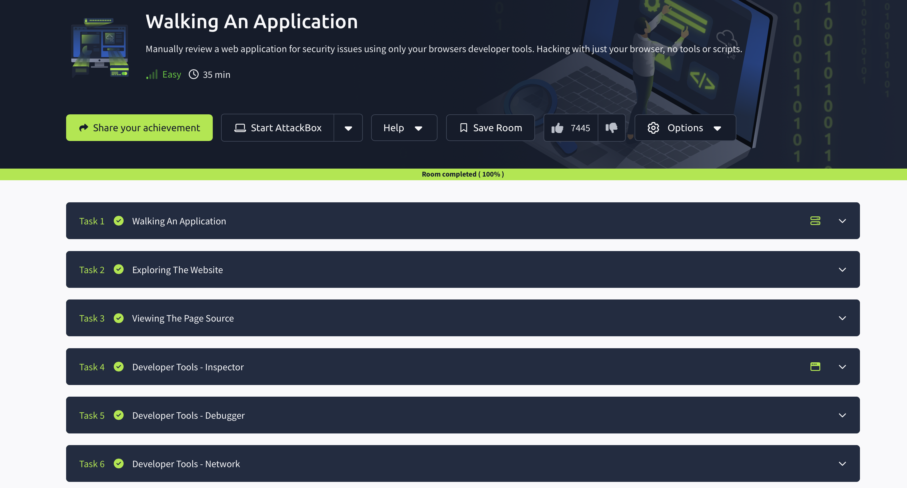

# 🛰️ TryHackMe – Walking an Application

## 🧾 Descripción

Sala centrada en entender cómo está organizada una aplicación web. Se trata de observar con calma y analizar qué partes están visibles y cuáles podrían estar un poco más escondidas, como subdominios, rutas o archivos que a veces se dejan por descuido.

---

## 🧠 Lo que aprendí

- Identificar subdominios y entender qué función cumplen  
- Qué es un *virtual host* y cómo acceder a él  
- Por qué archivos como `/robots.txt` pueden darnos pistas útiles  
- Cómo interpretar la estructura de una app web sin necesidad de herramientas agresivas  
- La importancia de tomarse el tiempo para mirar con lógica y sentido común  

---

## 🖼️ Evidencia de la sala completada

---

## 💬 Comentario personal

Me gustó porque no se trataba de usar herramientas todo el rato, sino de observar con atención. A veces solo navegando con calma se pueden entender muchas cosas sobre cómo está montado un sitio. Muy útil como introducción al reconocimiento web.
