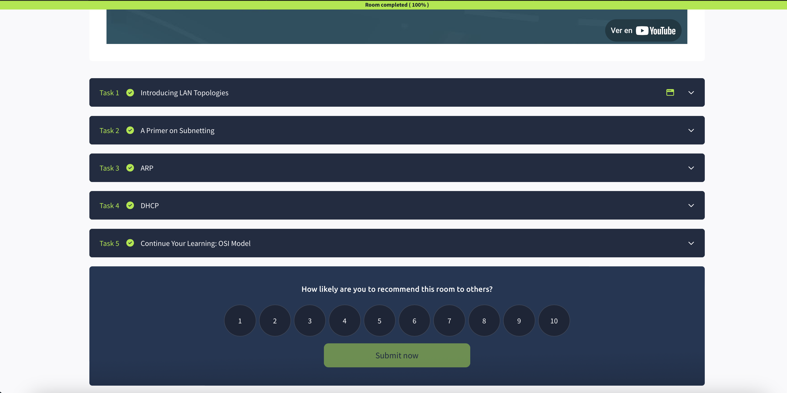

# 🌐 TryHackMe - Intro to LAN

## 📘 Descripción

Esta sala introductoria de TryHackMe está enfocada en los fundamentos de las redes locales (LAN). Aprendí los conceptos esenciales para comprender cómo se comunican los dispositivos en una red pequeña, como una casa u oficina.

---

## 🧠 Lo que aprendí

- Qué es una LAN y cómo funciona
- Qué es una **subred** y cómo se representa con una **máscara de subred**
- Las diferencias entre:
  - Dirección de red (ej. 192.168.1.0)
  - Dirección de host (ej. 192.168.1.10)
  - Dirección de puerta de enlace (ej. 192.168.1.1)
- Cómo se separan redes públicas y privadas con subredes
- El modelo **OSI** (capas de red: desde física hasta aplicación)
- Concepto de **encapsulación** de datos

---

## 🛠️ Herramientas o términos nuevos

- Máscara de subred (`255.255.255.0`)
- Encapsulación (cuando se añaden encabezados a los datos en cada capa)
- Roles en una red: host, gateway, red
- Tipos de dirección IP (pública vs privada)

---

## 📷 Evidencia de la sala completada

![completion][completionImage]

---

## 💬 Comentario personal

Esta sala fue una muy buena base para entender conceptos que siempre había escuchado, pero nunca entendía bien (como el modelo OSI o qué es realmente una puerta de enlace). Me sentí cómodo con los ejemplos visuales y lo recomiendo como primer paso en ciberseguridad.

---

